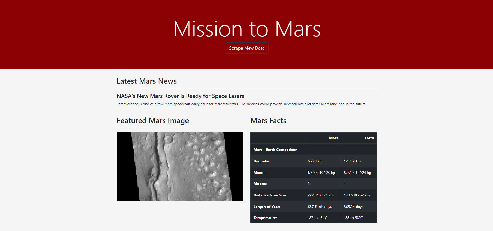

# GT Bootcamp Web Scraping Homework: Mission to Mars

## Table of Contents
1. [Introduction](#introduction)
2. [Objectives](#objectives)
3. [Technologies & Sources](#technologies)
4. [Files](#files)

### Introduction
In this assignment, I have been tasked with building a web application that scrapes multiple Mars-related websites, saves specified information, inserts information into a MongoDB, and displays the information on a single HTML page.

### Objectives
Scrape data using BeautifulSoup, Splinter, Pandas, and WebDriver_Manager:
* Latest News Title and Paragraph Text from [Mars News Site](https://redplanetscience.com/)
* Featured Mars Image URL from [JPL Mars Space Images](https://spaceimages-mars.com/)
* Mars Facts Table from [Mars Facts](https://galaxyfacts-mars.com/)
* Mars Hemisphere Titles and Full Resolution Image URLs from [Mars Hemispheres](https://marshemispheres.com/)

Use MongoDB and Flask templating to create a webpage that:
* Runs the Python script to scrape data at the click of a button
* Stores the scraped data into MongoDB
* Retrieves the most recent MongoDB entry
* Displays all collected information in a clean webpage on the index route

### Technologies & Sources
This project uses: 
* Python Version 3.6.13
* Jupyter Notebook Version 6.1.4
* Bootstrap Version 4.3.1
* Flask Version 1.1.2
* BeautifulSoup
* Splinter
* WebDriver_Manager
* PyMongo
* Mongo Version 5.0.2

### Files

* [Flask Application](Missions_to_Mars/app.py): Python script containing code for the Flask Application to run both the home page, actively scrape data, and store data in a Mongo Database for retrieval
* [Web Scraping Script](Missions_to_Mars/scrape_mars.py): Python script containing code to scrape all websites and return results as a dictionary
* [Web Scraping Test File](Missions_to_Mars/mission_to_mars.ipynb): jupyter notebook file containing all code used in the [Web Scraping Script](Missions_to_Mars/scrape_mars.py)
* [Webpage](Missions_to_Mars/templates/index.html): HTML written for the home page to include information from [Web Scraping Script](Missions_to_Mars/scrape_mars.py)

#### Screenshot of Top Portion of Web Page

#### Screenshot of Bottom Portion of Web Page
